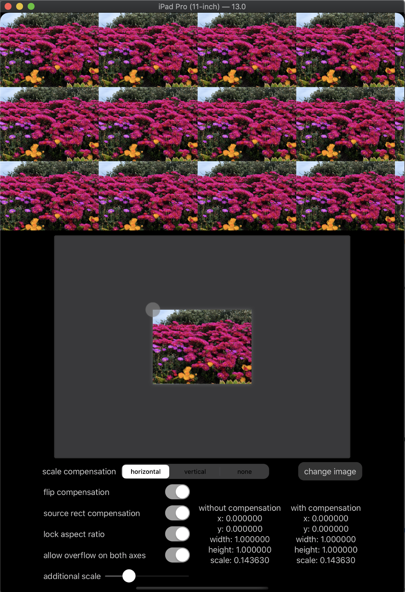

# ImagePaintPicker

This project implements an picker for SwiftUI's `ImagePaint`.  The picker is able to compensate for the vertically flipped coordinate system used by `ImagePaint`.  It is also able to compensate for the stretching behavior exhibited by `ImagePaint` when the source rect is smaller than a full unit rect.

